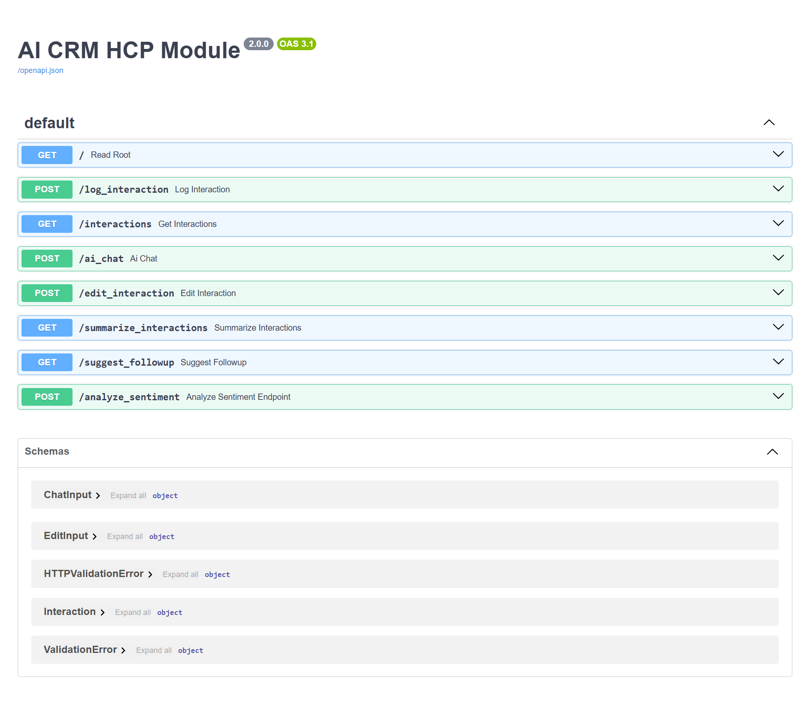
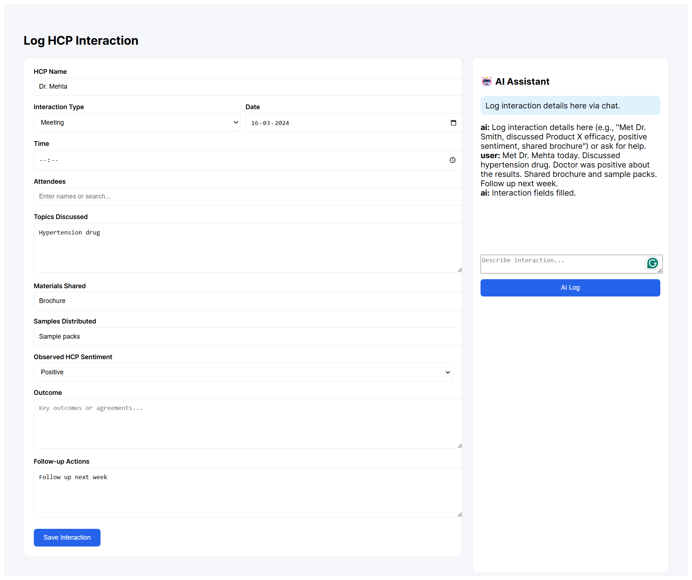

# AI CRM HCP Module

An AI-powered Customer Relationship Management (CRM) module for logging interactions with Healthcare Professionals (HCPs).  
This system allows pharmaceutical field representatives to log interactions through a structured form or via a conversational AI assistant.


# Project Overview

The application demonstrates an **AI-first CRM system** where interactions with doctors can be logged using natural language.

Example:

"Met Dr Sharma today. Discussed Product X effectiveness. Shared brochure and samples. Doctor seemed interested."

The AI extracts structured CRM data automatically and fills the interaction form.


# Architecture

React Frontend  
↓  
FastAPI Backend  
↓  
LangGraph AI Agent  
↓  
Groq LLM (Llama-3.3-70B)  
↓  
SQLite Database


# Tech Stack

Frontend
- React (Vite)
- Redux (state management)

Backend
- FastAPI
- SQLAlchemy

AI
- LangGraph
- Groq LLM (llama-3.3-70b-versatile)

Database
- SQLite (Prototype database)


# AI Agent Tools

The LangGraph agent includes the following tools:

### 1. Log Interaction
Extracts structured CRM data from conversation input.

### 2. Edit Interaction
Allows updates to interaction details using natural language.

### 3. Analyze Sentiment
Detects doctor engagement and sentiment.

### 4. Summarize Interaction
Generates a short meeting summary.

### 5. Suggest Follow-up
Recommends next actions for the sales representative.


# Features

- AI-assisted interaction logging
- Structured CRM form
- Sentiment detection
- AI-generated summaries
- Follow-up suggestions
- Interaction history storage


# Project Structure

```
AI-CRM-HCP
│
├── backend
│   ├── main.py
│   ├── agent.py
│   ├── database.py
│   ├── models.py
│   └── crm.db
│
├── frontend
│   └── crm-frontend
│       ├── src
│       ├── package.json
│       └── App.jsx
│
└── README.md
```


# Running the Project

## Backend

Navigate to backend folder

```
cd back-end
```

Activate virtual environment

```
venv\Scripts\activate
```

Start server

```
uvicorn main:app --reload
```

Backend runs at:

```
http://127.0.0.1:8000
```

Swagger API docs:

```
http://127.0.0.1:8000/docs
```

---

## Frontend

Navigate to frontend

```
cd front-end/crm-frontend
```

Install dependencies

```
npm install
```

Start development server

```
npm run dev
```

Frontend runs at:

```
http://localhost:5173
```


# Demo Workflow

1. Open the frontend application.
2. Log an interaction via AI chat.
3. The AI extracts structured data and fills the form.
4. Save the interaction.
5. View stored records via API.

## Screenshots

### Backend API (FastAPI Swagger)

This shows all available CRM and AI endpoints used by the system.




### Log Interaction UI (Before AI Interaction)

React interface where field representatives can manually log HCP interactions.


### AI-Powered Interaction Extraction

Users can describe interactions in natural language and the AI agent automatically fills the CRM form.




## Demo Video

[Click here to watch the AI CRM HCP Module demo](https://drive.google.com/file/d/1poCesIJBqt0VBsw36M3r9oTen_whisZ3/view)

# Assignment Context

This project was developed as part of an **AI-first CRM HCP Module assignment**, demonstrating how AI agents can support pharmaceutical sales workflows.

